# **ECS with Docker: A Complete Guide**

## **Basic Terminologies**

### **What is ECR?**

- **Elastic Container Registry (ECR)**: A fully managed Docker container registry where we upload Docker images.

### **What is ECS?**

- **Elastic Container Service (ECS)**: A scalable container management service that orchestrates Docker containers.

### **What is Fargate?**

- **Fargate**: A serverless compute engine that removes the need for server management.

### **Services we can use**

- Load Balancing
- Automatic Scaling

---

## **Flow of Working in Production**

1. **ECS**:

   - ECS doesn't directly run your source code; it runs containers.

2. **ECR**:

   - The Docker image is pushed to **ECR**.

3. **Cluster**:

   - A cluster is needed to host your containers/instances (the environment for your containers).

4. **Task Definition**:

   - Describes how to run the application, specifying the Docker image, CPU resources, etc.

5. **Fargate vs EC2**:

   - **Fargate** is serverless, with AWS managing the compute resources.
   - **EC2** is a VM where you define everything yourself.

6. **Service**:

   - A service ensures your container keeps running.
   - It tells ECS to:

     - Run a certain number of tasks.
     - Restart them if they fail.

7. **Network Security Groups**:

   - Assign a **VPC** and subnet to control access via IP addresses.

---

## **Prerequisites**

- AWS Account
- AWS CLI
- Docker installed on the system
- Node.js Application

---

## **Steps to Deploy a Node.js App on ECS**

### **1. Clone the GitHub Repository**

- If you don't have a NodeJS application, then clone this GitHub repository. It contains the basic Node.js application and Docker setup. The repository includes:

  - **README file**
  - **Dockerfile**
  - **Basic Node.js application**

---

### **2. Containerize the Node.js App with Docker**

- **Create a Dockerfile**: (if not already)

  - Add the necessary configuration to containerize the app.

- **Build the Docker Image**:

  - Open your terminal and run:

  ```bash
  docker build -t new-node-app .
  ```

  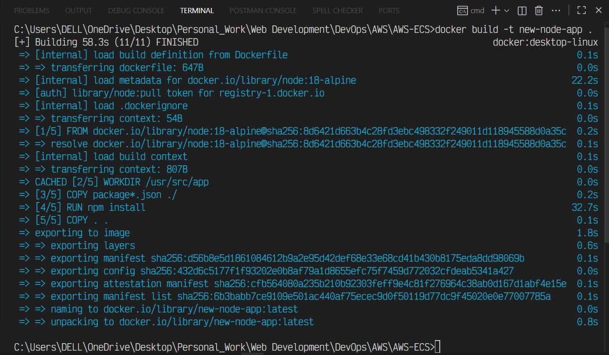

- **Run the Image**:

  - To run the image, use:

  ```bash
  docker run -p 8000:8000 new-node-app
  ```

  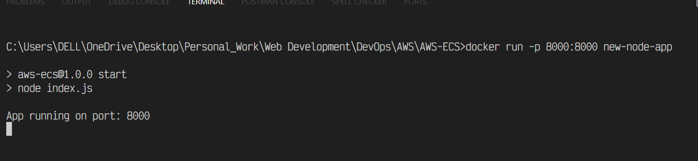

---

### **3. Create an ECR Repository**

- **Login to AWS Console**.
- **Search for ECR** and create a **Private Repository**.

  - Ensure the repository name matches the Docker image name.

  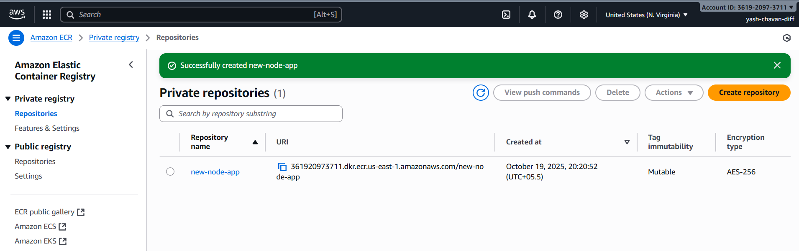

---

### **4. Push the Docker Image to ECR**

- After creating the repository, click on it.
- Click on **View Push Commands** and follow the commands provided for your OS to push the image to ECR.

  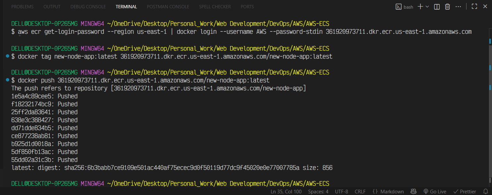

---

### **5. Create a Cluster in ECS**

- **Search for ECS** in the AWS Console and click **Create Cluster**.

  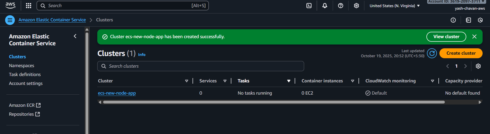

---

### **6. Set Up the Task Definition**

- **Create New Task Definition**:

  - When creating the task definition, choose the **task execution role**.

- **Create a Role**:

  - Go to **IAM > Roles** and create a new role.
  - Select the service **Elastic Container Service** and choose **Task Execution Role**.

  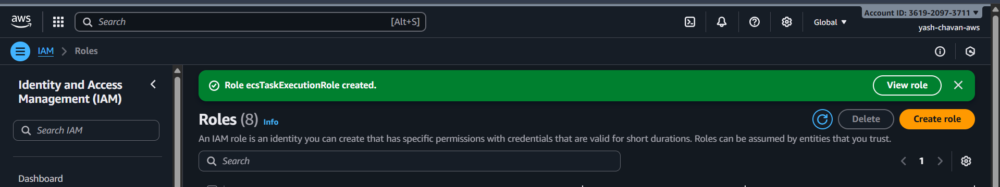

- **Attach the Role**:

  - After the role is created, attach it to the task definition.

  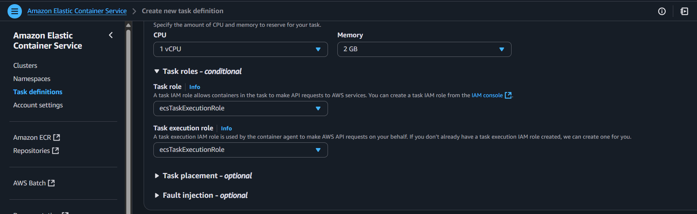

---

### **7. Configure the Container in Task Definition**

- **Add Container Configuration**:

  - Provide a name for the container and specify the **image URI**.
  - Define the port your application is running on (e.g., 8000).

  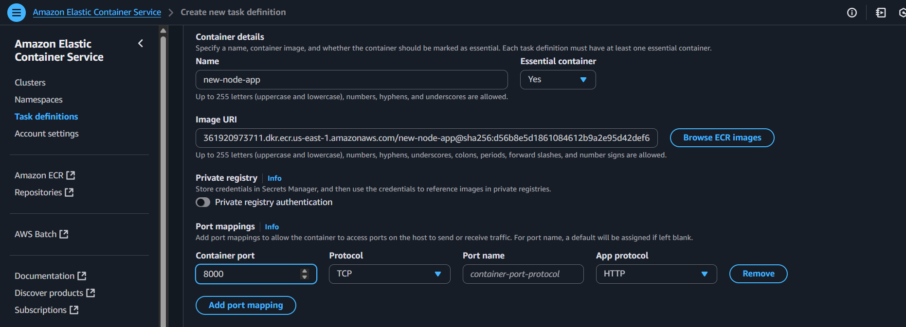

- Once done, **Save the Task Definition**.

  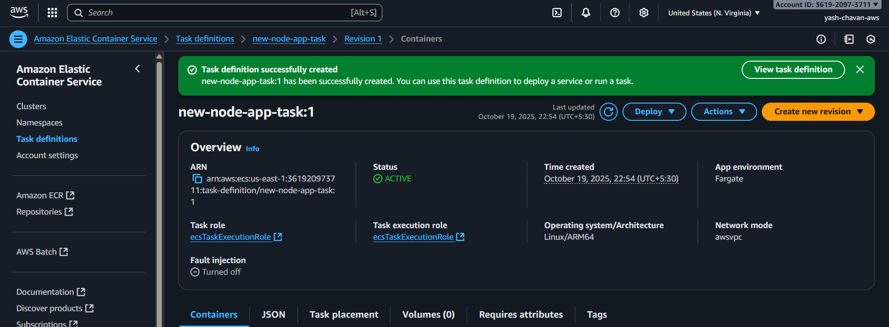

---

### **8. Deploy the Service**

- Go back to the **Cluster** you created and **Create a Service**.

  - Select the task definition family you just created.

  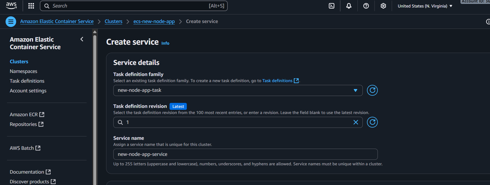

- Click **Create**. ECS will deploy the service.

- Once deployed, click on the service to see its status.

  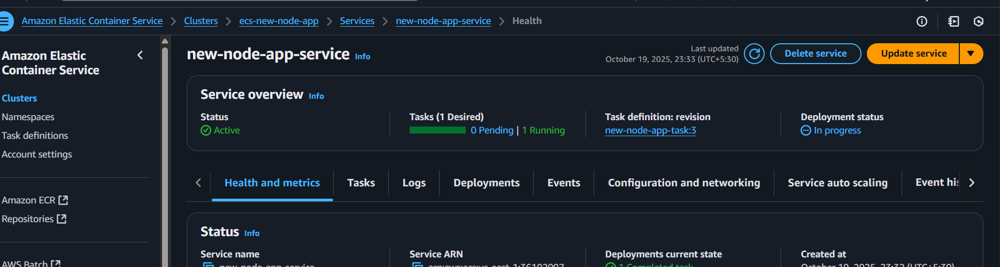

---

### **9. Service Deployment Options**

- **Automatic Scaling**: Adjust resources based on application demand.
- **Monitoring**: Use ECS console to log the status and health checks.
- **Application Load Balancer (ALB)**: Configure the load balancer between containers.

---

### **10. Best Practices**

- Use **multi-stage builds** to optimize Docker images.
- Set up **health checks** for container monitoring.
- Always **use roles** for proper IAM permissions.
- Use **monitoring** for tracking application health and performance.

---

### **11. Set Up Security Groups**

- Go to:
  **Clusters > Your Cluster > Services > Your Service > Configuration and Networking**.

  - Scroll to the **Security Group** section and click the link.
  - Create a security group with custom TCP access to the required port (e.g., port 8000).

  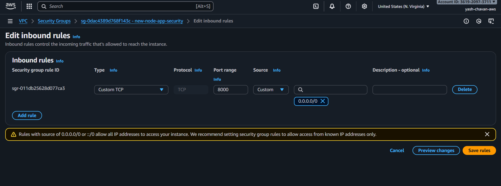

---

### **12. Test the Deployed Application**

- Go to:
  **Clusters > Your Cluster > Tasks Tab**.

  - Select your task, scroll to **Network Bindings**, and click on the **Public IP Address** at the bottom right.

  This will open your deployed application.

  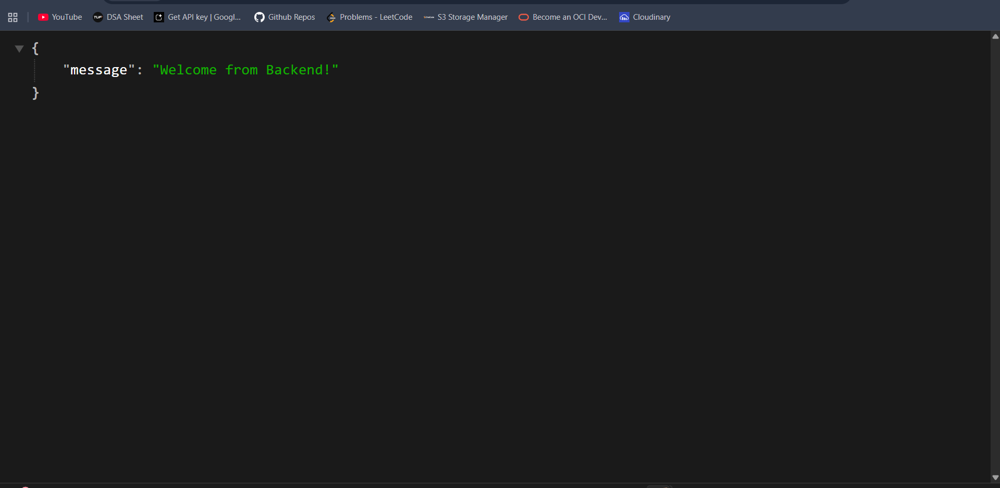

- Visit the **/health** route to check the health status.

  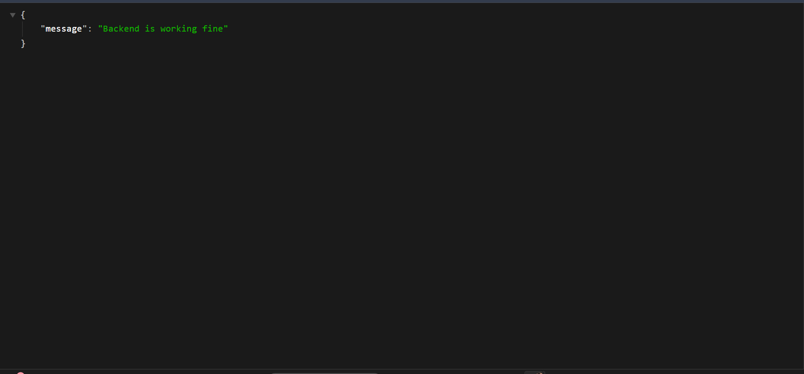

---

### **13. Stop Everything to Save Costs**

To avoid unnecessary charges, ensure to clean up the resources:

1. Delete the **Service**.
2. Delete the **Cluster**.
3. Delete the **Task Definition**.

---
